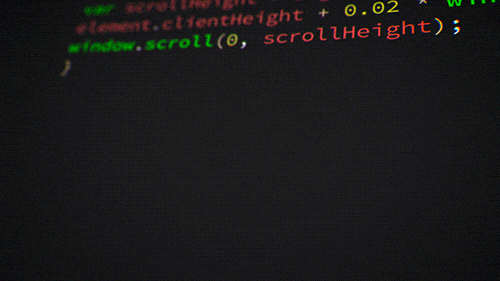

  

<!-- About Me Section -->
<!-- About Me Section -->
<h2 align="center">⚡ About Me</h2>

<table>
  <tr>
    <!-- Left Side: Coding GIF -->
    <td width="35%" align="center" valign="middle">
      
        
      <h3>BUILD. BREAK. UNDERSTAND. REPEAT.</h3>
      
<i>Turning ideas into reality, one commit at a time.</i>

    </td>

    <!-- Right Side: About Me Content --->
    <td width="65%" valign="middle">

      <h3>👨‍💻 Full-Stack Developer | Frontend & Backend Engineering</h3>

      

        I'm a Computer Science graduate passionate about building beautiful,
        intuitive user interfaces and robust backend systems. I enjoy turning
        ideas into complete, functional products—from crafting engaging
        frontend experiences to designing reliable APIs and working with databases.
      

      

        💻 <b>Frontend:</b> Building responsive, interactive user interfaces
        with React, JavaScript, and modern web technologies.
      

      

        ⚙️ <b>Backend:</b> Developing REST APIs, authentication systems,
        and server-side applications with Node.js and Express.
      

      

        🗄️ <b>Databases:</b> Working with MongoDB and MySQL to design
        and manage application data.
      

      

        🧠 <b>Problem Solving:</b> Solved 200+ problems on LeetCode.
      

      

        🚀 <b>Building:</b> Full-stack applications that combine thoughtful
        UI/UX with reliable backend functionality.
      

      

        🌱 <b>Currently Exploring:</b> Advanced React, state management,
        backend architecture, and system design.
      

      

        🤝 <b>Open to:</b> Frontend Engineer, Backend Engineer,
        Full-Stack Developer, and Software Engineer opportunities.
      

    </td>
  </tr>
</table>

## Technical Skills

**Languages**

  

**Frontend**

  

**Backend & Databases**

  

**Tools & Platforms**

  

## Selected Projects

<table>
  <tr>
    <td width="50%" valign="top">
      <h3>Career Connect Hub</h3>
      
A full-stack platform connecting job seekers through professional networking, mentorship, messaging, and job recommendations.

      
<strong>Stack:</strong> React · Node.js · Express · MongoDB

      <a href="https://github.com/Dhanushcdivakar?tab=repositories">Explore repositories →</a>
    </td>
    <td width="50%" valign="top">
      <h3>NyayaSetu</h3>
      
A legal assistance prototype combining blockchain technology, multilingual capabilities, and AI-powered assistance.

      
<strong>Stack:</strong> MERN · Hyperledger Fabric · Azure AI

      <a href="https://github.com/Dhanushcdivakar?tab=repositories">Explore repositories →</a>
    </td>
  </tr>
  <tr>
    <td width="50%" valign="top">
      <h3>PennyPilot</h3>
      
A Flutter personal finance application for tracking transactions and managing financial data locally.

      
<strong>Stack:</strong> Flutter · Dart · Hive

      <a href="https://github.com/Dhanushcdivakar?tab=repositories">Explore repositories →</a>
    </td>
    <td width="50%" valign="top">
      <h3>More from me</h3>
      
Explore my repositories for additional projects, experiments, and contributions.

      <a href="https://github.com/Dhanushcdivakar?tab=repositories">Browse all repositories →</a>
    </td>
  </tr>
</table>

## GitHub Activity

  
  

 

  <a href="https://www.linkedin.com/in/dhanush-c-d-9403772a7/">
    LinkedIn
  </a>
  &nbsp;·&nbsp;
  <a href="https://github.com/Dhanushcdivakar">
    GitHub
  </a>
    
  Build. Break. Understand. Repeat.

